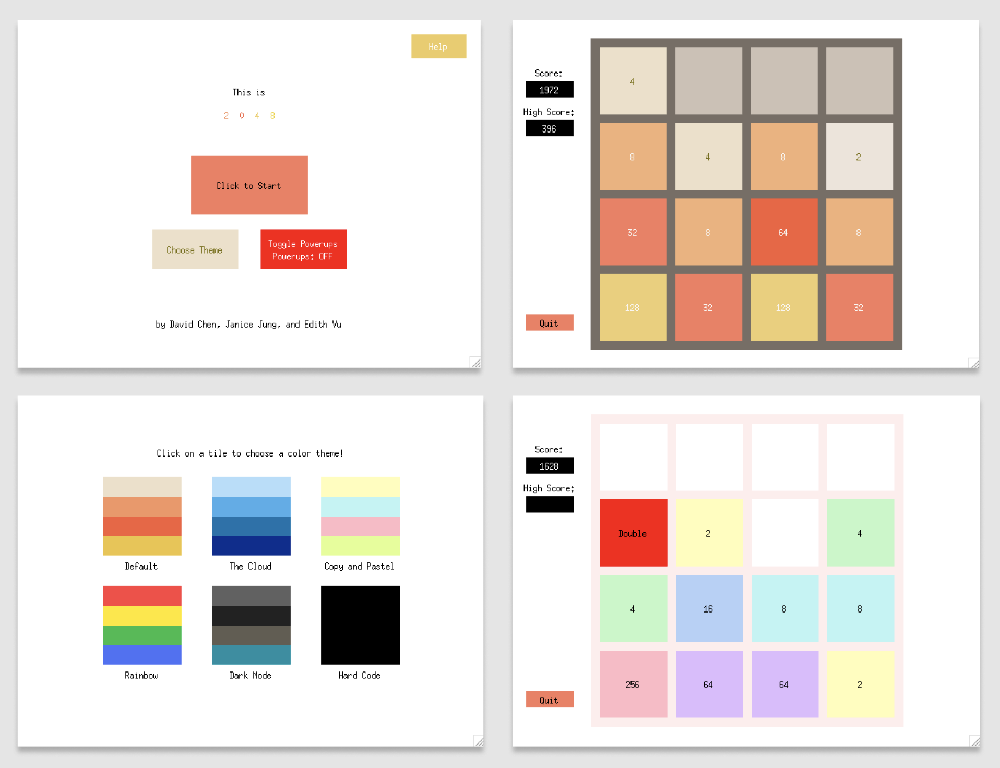

# CS 3110 Final Project: 2048 

## An extended version of *2048*
For our final project, we decided to create an upgraded version of the existing game 2048. This version of 2048 is a GUI-based game with added features that will elevate your game-playing experience! 

These features include various power-ups, such as *shuffle* that mixes up all the tiles on your playing board and *double* that doubles all your tiles, that make the game both more challenging and exciting. These powerups can be turned on and off depending on your preference in the home screen. Additionally, the color theme of the game can be customized by the user; simply select *Choose theme* on the home screen and choose out of 4 different themes. At the end of the game, the highest score is saved and displayed in the top left of the screen and is updated with every gameplay.

### Powerups 
Here are all the available powerups in 2048:
* Double: Doubles all the tiles on the board
* Half: Halves all the tiles on the board; *2* tiles remain the same
* Sort: Sorts all the tiles on the board in descending order in the direction you last moved
* Shuffle: Shuffles the position of all the tiles on the board
* Remove: Removes a random tile from the board

